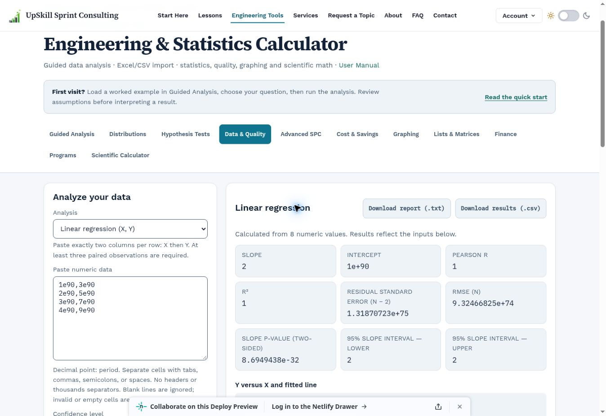
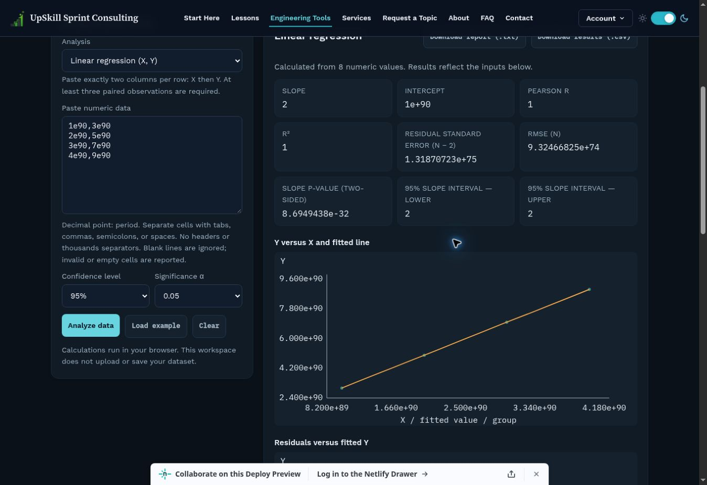

# Final calculator QA audit — 4 October 2026

## Disposition

**Scoped calculator checks pass after correction; ready for human PR review. This is not an unconditional site-wide release sign-off.** PR #236 remains open and unmerged.

This was a fresh adversarial review by the implementing assistant, using independently generated numerical references and new failure cases. It is not third-party certification or an audit by a separate human reviewer. The scope is the calculator, its eleven workspaces, companion manual and integration with shared site chrome—not every lesson, authentication flow or exam tool on the site.

Reviewed baseline: remote `15ebb6c90436e16c688e2d79845e331e01b0308a` (same tree as local `3502d5d`). Repaired application reviewed in the browser: `ac677ef4b408b1f28d377555686296a9338e2965`, tree `5ce72044f04a25503ebe2f055c133045fe3fd451`.

## Findings and corrections

| ID | Finding / consequence | Correction and verification |
|---|---|---|
| QA-01 | Multiplying sums of squares overflowed/underflowed: a perfect relationship in large units displayed Pearson r = 0 while R² = 1. | Divide by the two norms separately. Positive and negative perfect relationships at 1e90 and 1e−90 pass; deployed browser changed from r = 0 to r = 1 for the same data. |
| QA-02 | Welch degrees of freedom became NaN after otherwise valid unit changes, blocking guided and summary tests. | Normalize variance weights before squaring. Both entry paths retain df = 4 and p ≈ 0.02131164 for the reference case. |
| QA-03 | Nonconstant, extremely small measurements could appear to have zero variation after squared differences underflowed. | Reject unrepresentable variation with a rescaling instruction; truly constant samples remain supported for descriptions. |
| QA-04 | An extreme polynomial fit could publish R² = 1 beside an unusable original-unit equation containing non-finite coefficients. | Validate coefficients as well as fitted values; reject the result and ask for rescaling. |
| QA-05 | Goodness-of-fit accepted unsafe total event counts and non-finite χ² results. | Enforce the safe-integer total and finite statistic/p-value. The manual explicitly warns against dividing event counts to bypass the limit. |
| QA-06 | Tiny EWMA λ caused cancellation in startup limits, yielding zero-width limits and false signals. | Use log1p/expm1 and a stable update. λ = 1e−20 yields the independently checkable width 3√2 × 1e−20; unresolvable limits are rejected. Browser reports no false monitoring signal. |
| QA-07 | A constant sample near 1e20 produced NaN chart coordinates because absolute axis padding disappeared. | Relative, representable padding. All three descriptive plots contain finite coordinates in unit and live mobile checks. |
| QA-08 | Extreme cost ratios could publish Infinity, which JSON would silently serialize as null; positive cost lines could underflow to zero. | Validate all derived cost results and positive line products. Failed runs clear previous results and disable exports; tested in the deployed browser. Legitimately unavailable ratios remain null/unavailable. |
| QA-09 | Large-value chart tick labels were clipped during visual review. | Compact scientific tick notation, wider left gutter and in-plot limit labels. Light/dark visual evidence below. |
| QA-10 | The manual ambiguously counted seven storage locations including Ans and described all primary key text as white. | Distinguish seven user registers from automatic Ans; describe theme-dependent key colours. Add numerical-range, EWMA-resolution and cost-error guidance without removing teaching headings. |

## Validation evidence

- **78/78 calculator tests pass**, up from 68. Eight new failure-focused test groups were first observed failing on the previous implementation. Two additional tests cover 100 fresh independent reference cases.
- `generate-final-qa-references.py` uses seeded NumPy data and **SciPy 1.17.0**, without executing calculator code. It calculates references before applying five common unit factors from 1e−90 through 1e90: 50 regression and 50 Welch cases, with 300 checked metrics. The fixture and generator are committed.
- Existing 360 SciPy distribution comparisons, guided-inference references, SPC references and 40-digit Decimal quality-cost scenarios continue to pass. Existing tests cover inputs, imports, data exclusions, stale output, asynchronous responses, saved projects, export payloads, unsupported code and all workspace examples.
- `npm run build:site` exits 0. Build-generated changes were removed from the proposed source changes. `git diff --check` passes.
- The repaired application commit passed **Engineering calculator validation**, **Smart lesson search validation**, **Stateless test bank**, and the **Netlify deploy preview**.
- Browser checks confirmed corrected correlation; scaled summary Welch inference; normal cost example and error/export recovery; small-weight EWMA and a clear resolution error; constant-value descriptive charts; and preserved shared header/theme controls.
- **44 narrow calculator states** (11 workspaces × 2 themes × 320/390px iframe widths): correct active workspace and no page overflow. Four narrow manual states: all 24 TOC links resolve, numerical guidance and register clarification present, no page overflow. These are real responsive iframe layouts, not physical-device tests. See `calculator-final-qa-browser.json`.
- The calculator/manual teaching heading sets are unchanged. Changes to prose are the targeted corrections and additional guidance above.

Reproduce the scoped suite from the repository root:

```bash
node --test tests/calculator-*.test.js
npm run build:site
```

Independent method checks: [NIST Pearson correlation](https://www.itl.nist.gov/div898/software/dataplot/refman2/auxillar/correlat.htm) and [NIST two-sample t/Welch formulation](https://www.itl.nist.gov/div898/handbook/eda/section3/eda353.htm). The EWMA one-step check also follows directly from z₁ = λx₁ + (1−λ)μ and SD(z₁) = λσ.

## Remaining gates and limits

1. **Do not describe the whole repository test suite as green.** A clean-source full run was bounded at 60 seconds and did not complete, with pending-event-loop/JSDOM problems. Four isolated failing checks reproduce with the same 30-pass/4-fail outcome on both pre-audit `3502d5d` and repaired source:
   - `pr170-final-browser-guards`: missing `test-bank-phase2-quality-assurance.js`.
   - `second-pass-workflows`: missing `test-bank-account-sync.js`.
   - `require-auth-gate`: material-lookup builder does not match the expected `authHead` source pattern.
   - `steel-phase-guide-compliance`: two unrelated Excel pages lack exact shared-controller tags (`assets/lessons/excel-formula-fluency/sprint/introduction.html` and `excel-sprint-certificate.html`).
   These are pre-existing test failures, not newly established security vulnerabilities. No unrelated exam/auth/Excel behavior was changed under this calculator task. Other unfinished full-run results are unverified, not claimed to be baseline defects.
2. **Actual downloaded-file delivery remains unverified.** A fresh cloud-browser attempt timed out waiting for the cost report download. Automated Blob/report/CSV/project payload checks pass. Confirm local-browser download and restore before production acceptance.
3. Physical iOS/Android devices, screen-reader workflows, comprehensive automated accessibility, cross-browser coverage, and exhaustive input-space accuracy are not certified. The prior student UI audit contains the broader theme/contrast inspection. This pass adds responsive and targeted visual checks, not a formal WCAG conformance claim.
4. Full-page/clip screenshot capture is unreliable in this browser; retained viewport screenshots provide evidence. The responsive review harness was reused from an already open QA tab and is not shipped as a public tool page.
5. The tool remains an independent browser calculator, not complete TI-84 Plus CE hardware/OS/application emulation. Numerical checks do not certify study assumptions, process stability, accounting evidence or realized benefits.

Human reviewer should resolve or formally disposition the unrelated repository checks, perform the local download/restore check, and approve the PR before merging.

## Visual evidence




