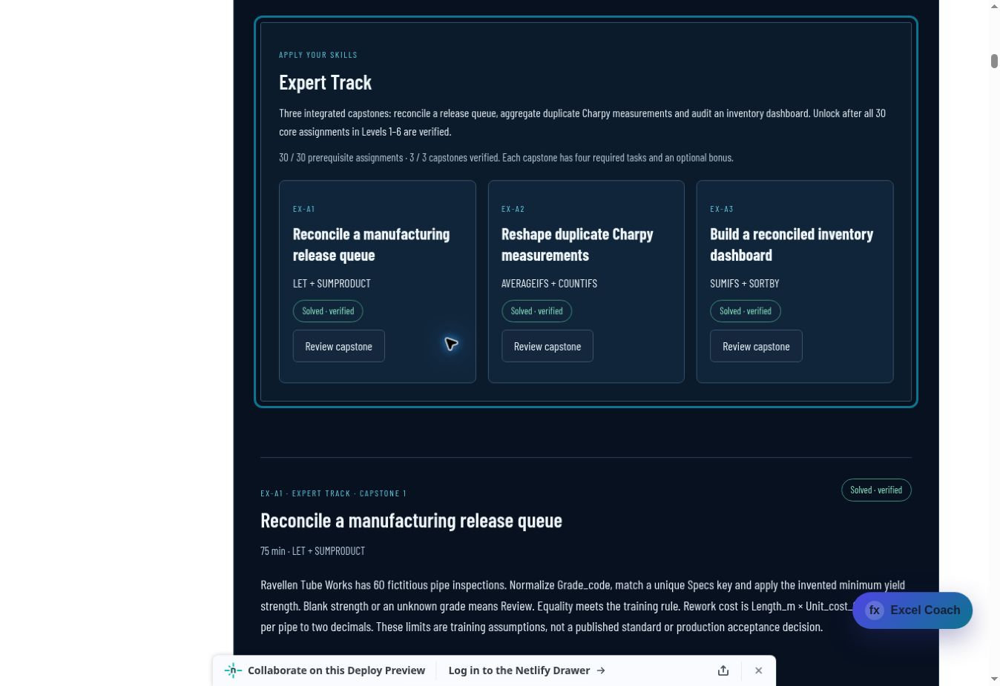
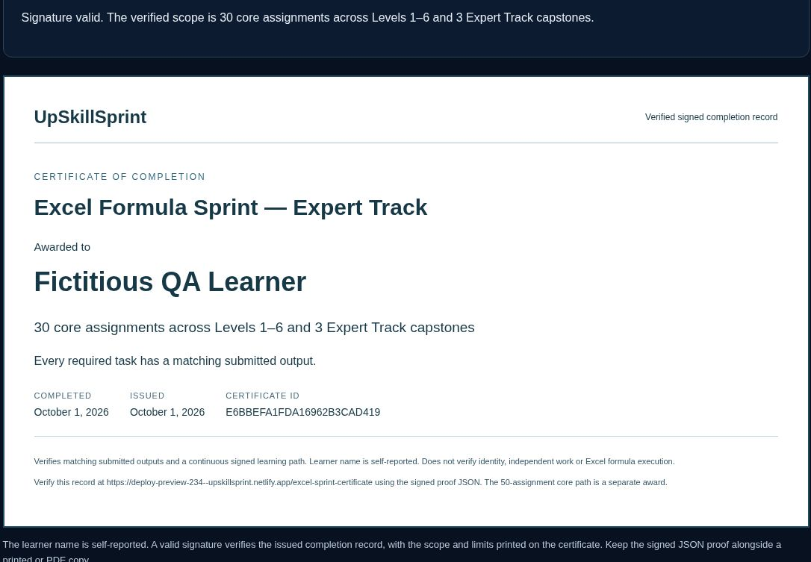

# Excel Formula Sprint — Expert Track and certificates

Expert Track v1 is a separate mastery route after the thirty Levels 1–6 assignments. It adds three seeded capstones with four required tasks and an optional bonus each. The full fifty-assignment core path and Levels 1–10 award are now released; see [Levels 7–10](excel-sprint-levels7-10.md). Placement and adaptive reinforcement remain future work. Completing Expert Track keeps its fixed thirty-core-plus-three scope.

## Capstones

| ID | Challenge | Required behavior |
| --- | --- | --- |
| EX-A1 | Manufacturing release queue | Normalize imported grades, guard missing strength and unknown specifications, classify every pipe, sort a rework queue and reconcile rounded costs. Limits are fictitious training assumptions. |
| EX-A2 | Duplicate Charpy measurements | Group by both sample and heat, normalize LPA/TWA, average numeric replicates, retain measured zero and expose missing orientations. Sample identifiers remain text with leading zeros. |
| EX-A3 | Inventory dashboard | Reconcile opening stock with receipts, dispatch and scrap, preserve negative stock, prioritize shortages and independently audit the movement total. |

The lessons introduce LET and SUMPRODUCT where useful and reinforce conditional aggregation and dynamic reports. Microsoft 365 Excel remains the target engine. Formula signatures and blank handling were checked against Microsoft's [LET](https://support.microsoft.com/en-us/excel/functions/let-function), [SUMPRODUCT](https://support.microsoft.com/en-us/excel/functions/sumproduct-function) and [AVERAGEIFS](https://support.microsoft.com/en-au/excel/functions/averageifs-function) documentation.

## Signed progress and compatibility

Core tokens remain in `tokens`; capstone tokens are saved separately in `expertTokens`. Backups without the new field default to an empty Expert Track. Schema, core curriculum version, original keys and signing secret remain unchanged. EX-A1 requires the L6-A5 completion; later capstones require their immediate predecessor on the same learning path. Full backup verification checks both chains together. Expert Track v1's thirty-package prerequisite is fixed, so future core releases must preserve this branch's predecessor and certificate scope.

Capstones use the same private result grader, signed attempt receipts, gated model solutions and optional formula coaching. All required outputs must pass; bonuses and first-attempt scores do not prevent completion. Progress and work remain in browser storage. No accounts or learner database are added.

## Certificates

`POST /api/excel-sprint/certificate` verifies the complete submitted progress chain before issuing either award:

- `levels-1-6`: all thirty core assignments.
- `expert-track-v1`: those thirty core assignments plus all three capstones.

The fifty-assignment certificate is unavailable until the remaining core curriculum is implemented. Its award is not accepted by the issuance endpoint. The UI shows this explicitly.

Certificates include the self-reported learner name, exact package scope, completion and issuance dates, an ID and hashes of the terminal proofs. They are signed with a separate certificate HMAC domain using the existing stable `EXCEL_SPRINT_SIGNING_SECRET`. No new configuration or secret rotation is required. Signed proof JSON can be downloaded, shared and verified at `/excel-sprint-certificate`. `POST /api/excel-sprint/certificate/verify` accepts only a certificate token. Edited names or claims fail signature verification. The page displays and enables printing only after verification, clearing a previously displayed certificate when its input changes or verification fails.

The certificate page provides landscape printing / Save as PDF, and a verification link containing the signed token in its URL fragment. The token includes the displayed learner name; the UI explains this before sharing. JSON proof is independent of browser progress backups and is required to verify a saved PDF later. Proofs attest to matching submitted outputs and a continuous signed learning path. They do not attest to identity, independent work or Excel formula execution. The existing stateless receipt replay limitation remains.

## Workbook authoring and build

Three source XLSX files are authored with `scripts/author-excel-sprint-expert-workbooks.mjs` using the primary runtime's artifact-tool in a temporary directory. Use the spreadsheet creation marker once before authoring. The script renders all fourteen sheets and appends curriculum fingerprints and SHA-256 hashes to the existing manifest. The portable generator verifies the committed sources before copying public XLSX downloads. Answer areas are empty and contain no model formulas. Separate supporting CSVs are provided for Specs and Stock.

Run `npm run build:excel-sprint` for deterministic public packages and private keys. Netlify continues to publish only `public-site`; the source curriculum, workbook manifest, private answers and server code stay outside that directory. The certificate page lives at the site root as a utility page and is noindex, preserving the lesson catalog's complete coverage rules.

## Validation

47 focused Sprint tests cover existing assignments and coaching, Expert Track sequencing and backup restoration, signed certificate eligibility, name/scope tampering, cross-domain proof rejection, markup validation, stale verification responses and learner controls. The import regression checks enabled controls after restoring both core-only and completed Expert progress, and preserves drafts when an import fails. All three XLSX files were rendered and read back: data and supporting tables match their seeds, text identifiers retain leading zeros, and answer areas have no formulas or values. All ninety original core package/CSV/XLSX files remain byte-identical. 122 search/catalog regressions, 21 production-index tests and the complete public-site build pass.

### Live preview — October 1, 2026

The [draft preview](https://deploy-preview-234--upskillsprint.netlify.app/lessons/power-bi-excel-sql/excel-formula-fluency#sprint-expert) passed 24 HTTP checks. The existing thirty-core proof chain still verifies; all twelve required capstone outputs pass; both released awards issue and verify with their exact scope. Skipped capstones, incomplete core/Expert paths, a requested full-path award, an edited certificate name and a completion token used as a certificate are rejected. All three workbook downloads match committed bytes, the noindex certificate utility loads, and private source paths return 404. Live submissions were independently computed from the public, fictitious datasets.

Browser validation covered locked gates before the core milestone, core-only backup import, all three capstones in sequence (including text sample identifiers), certificate issuance, downloaded signed JSON and verification through both the issued link and the downloaded file. Changing or submitting an invalid proof clears the certificate and disables printing. Importing completed Expert progress restores both certificate controls immediately. GitHub Sprint and Smart lesson search validation pass for the reviewed implementation.

The screenshots below use **Fictitious QA Learner** and fictitious QA progress. They are validation evidence, not an actual learner's completion record. Native Excel execution and a saved PDF were not part of this validation.

