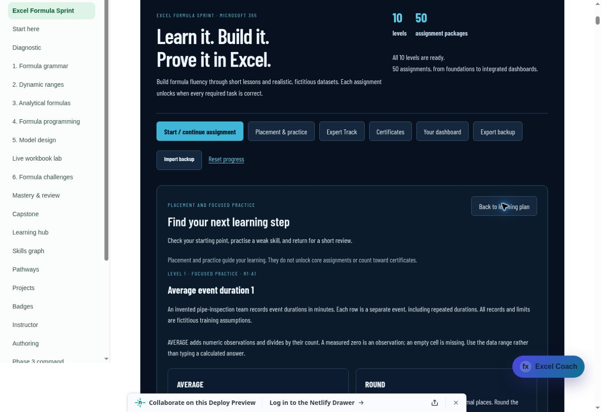

# Excel Formula Sprint: placement and targeted practice

This phase adds optional placement guidance and practice alongside the fifty-assignment core path. The ten-question diagnostic samples one concept from each level. It provides a study recommendation rather than an Excel skill certification. Skipped questions remain unassessed.

## Learner flow

The Placement & practice section is available before the first core assignment. Learners can take the diagnostic, review recommendations, or select a practice skill directly. Each of ten skills has two fresh, fictitious dataset variants, a brief re-teach and a formula-plus-result exercise. Drill hints escalate after failed submissions; model solutions and alternatives require a signed successful drill receipt.

Recommendations combine incorrect or skipped diagnostic items, verified core first-attempt scores below 70%, and review sessions due in this browser. The next core link always follows the existing sequential course gate. A diagnostic result never skips core work.

Confirmed successful practice sets a review due after one day. Successful due reviews move to three, seven and fourteen days, with the other dataset variant selected for the next review. Reusing the same receipt does not advance the schedule. Practice completed early does not accelerate a scheduled review. Dates display in Regina time. Due sessions appear when the learner visits; this feature does not send background reminders.

## Progress and proof boundaries

The existing version 1 progress format gains an optional learning record. Older backups load with an empty record. New backups retain diagnostic responses, drill drafts, signed results and local review dates. Results from restored backups are verified before they inform recommendations. Failed verification preserves drafts and permits a fresh practice attempt.

Learning receipts use their own signature domain and types. They cannot serve as core or Expert completion proofs and do not count toward any certificate. The original core packages, their keys, workbook sources and award scopes remain stable.

Public packages and downloads contain only scenarios, mini-lessons, task instructions and fictitious datasets. Diagnostic answer choices, grading keys, hints and model formulas stay in excluded server inputs. Grading checks submitted output values and formula syntax; it does not execute Excel or establish independent formula-writing ability.

## Validation

All twenty independently calculated practice outputs pass local grading. The calculations use only public rows and task contracts. Exported XLSX readback verifies all 1,281 source cells, preserved text/whitespace/numeric zero, and empty learner output ranges. All sixty rendered workbook sheets were visually reviewed. Workbook fingerprints and byte hashes pass the portable generator.

The full site build, 122 search/catalog checks and all 106 Sprint tests pass. Focused and existing Sprint checks cover private grading, signature boundaries, core/Expert compatibility, diagnostic skip handling, first-attempt preservation, draft export/import, model gating, malformed records, review intervals, anchor verification, thirty-one-receipt batch restoration, and import/reset races. An independent engineering review found no remaining blocking defects.

Live verification on draft PR #234 exercised all twenty drills with independently calculated outputs from the public datasets. An intentionally incorrect Level 1 result produced a hint; its corrected retry completed after two attempts and scheduled the first review. A mixed diagnostic produced 80%, recommended the missed skill and left the skipped skill unassessed. The existing ten core completions, next L3-A1 link and learning results were restored after a reload. Practice did not unlock core work or certificates. Model comparisons became available only after successful practice.

The browser review exposed a focusout refresh that could replace a pressed button before its click. The fix preserves focused interactive controls; regression tests cover mouse press/release and explicit verification retries. A fresh live run on deploy `6abeff037c114c0008af40d5` confirmed single-click submission and preserved the original review date after early practice. This deploy is ready at commit `8affcb2a2a13eb9f92310843ab5beb6615cf0fa9`.

Cloud-browser download events timed out for both an XLSX link and the existing backup export, so live file retrieval is unverified. All workbook contents and backup round trips were checked locally. Native Excel execution is not claimed.

