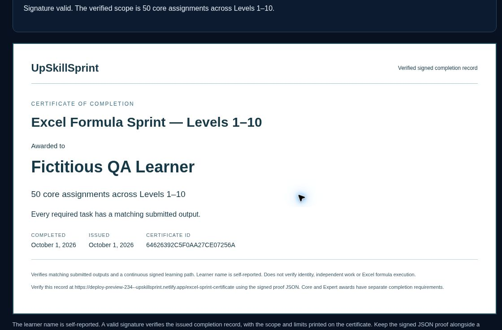

# Excel Formula Sprint — Levels 7–10

All fifty core assignments are now released. The final twenty packages add 885 fictitious source records, twenty XLSX downloads, eleven supporting CSV tables, eighty required tasks and twenty optional bonuses. Every lesson is under 400 words and includes two documented function signatures, arguments, worked miniature examples, common mistakes and a review of earlier skills.

| Level | Assignments | Main skills | Required orientation assignment |
| --- | --- | --- | --- |
| 7 | L7-A1–A5 | Weighted totals, Boolean arrays, multi-key and two-way lookups, exception filters | L7-A3: numeric duplicate means by sample and heat |
| 8 | L8-A1–A5 | LET, LAMBDA, MAP, BYROW, BYCOL, SCAN, REDUCE and named calculations | L8-A5: reusable guarded orientation-mean calculation |
| 9 | L9-A1–A5 | GROUPBY, PIVOTBY, sample spread, percentiles, paired correlation and illustrative capability | L9-A2: pivot numeric replicate means with explicit missing markers |
| 10 | L10-A1–A5 | Guarded reports, shipment reconciliation, formula audit, business dashboard and integrated capstone | L10-A5: two-key Charpy report, training statuses and reconciled hold costs |

Each orientation report retains both text identifiers, normalizes LPA/TWA, averages every numeric replicate and rounds means to two decimals. Blank replicates are excluded, measured zero is retained, and an all-blank group produces Missing. Tests cover reused sample numbers across heats, zero means, incomplete orientations and equality at training limits. The catalog records the orientation assignment for each new level.

Microsoft's current [GROUPBY](https://support.microsoft.com/en-us/excel/functions/groupby-function) and [PIVOTBY](https://support.microsoft.com/en-us/excel/functions/pivotby-function) documentation was checked before authoring their full signatures. Lessons provide compatible scaffold/conditional-aggregation alternatives. Advanced helpers preserve source numeric-status flags or explicit text markers before blank values can be coerced to zero. Templates require current Microsoft 365; comma separators may need localization in Excel.

The statistics exercises distinguish sample STDEV.S from the separately assumed within-process sigma. Capability assumes a stable normal process for illustration and does not demonstrate those assumptions. Historical-reference limits are for individual observations and are distinct from specification limits. Correlation uses a single complete-pair mask and makes no causal claim. These distinctions follow the [NIST capability definitions](https://www.itl.nist.gov/div898/handbook/pmc/section1/pmc16.htm); all supplied limits and process data are training assumptions.

## Progress and certificates

The core proof chain extends from L6-A5 to L7-A1 and ends at L10-A5. Curriculum/package versions and the existing signing secret remain unchanged. All thirty original core keys, all three Expert keys and their existing package/CSV/XLSX assets remain unchanged.

Expert Track v1 still branches from the fixed L6-A5 completion, even when the browser also holds fifty core proofs. Its prerequisites display at most 30/30. At the end of the full core path, the assignment panel links to certificate eligibility.

| Award ID | Required scope |
| --- | --- |
| levels-1-6 | First 30 core assignments, Levels 1–6 |
| expert-track-v1 | Those same 30 core assignments plus EX-A1–A3 |
| full-path | All 50 core assignments, Levels 1–10; no Expert capstone requirement |

Older award names, claims, completion dates and certificate identities stay stable when a learner later completes the core path. A forty-nine-assignment chain cannot issue the full award. Signed proof verification, proof-file download, shareable link and print/Save as PDF use the existing certificate page. Names are self-reported. Grading checks matching submitted outputs and a syntactically valid formula; it does not execute Excel or verify identity/independent work. Placement guidance and targeted reinforcement are documented in [Placement and practice](excel-sprint-learning.md).

## Download production and validation

The twenty new sources were authored with the primary artifact runtime, and all 91 worksheets were rendered and visually reviewed. Saved OOXML readback verifies 3,794 public source cells, original text identifiers, numeric zero and empty required/bonus answer areas. No template contains model formulas. The renderer displays some numeric-looking text without leading zeros; the exported cells remain typed text with their exact original identifiers.

`scripts/author-excel-sprint-phase3-workbooks.mjs` is the authoring entry point. Follow the existing temporary-runtime workflow, then review the rendered sheets. `npm run build:excel-sprint` checks source fingerprints and SHA-256 values and copies the committed XLSX bytes; portable Netlify builds do not require the authoring runtime. Public staging excludes curriculum, private keys and function source.

Local validation passes 57 Sprint tests, 122 search/catalog regressions, the full site build and 21 production-index tests. No native Excel execution or saved PDF is claimed.

## Preview evidence

The [draft PR #234](https://github.com/UpSkillSprint-Consulting/upskill-sprint/pull/234) preview is deployed at the [existing Formula Fluency lesson](https://deploy-preview-234--upskillsprint.netlify.app/lessons/power-bi-excel-sql/excel-formula-fluency#excel-sprint). Netlify deploy `6abedc1364f0c900082102aa` is ready for code revision `14a17dd53e2d07056aad6565d0a87d139f748c62`. All seven GitHub workflows pass, including Excel Formula Sprint and Smart lesson search. Main has not been merged.

All records below use the self-reported name **Fictitious QA Learner**. Independent preview calculations read only public datasets and task contracts; private answer keys and model solutions were not submitted to the service.

| Check | Result |
| --- | --- |
| Twenty deployed public packages | Match the committed package JSON exactly |
| Twenty new assignments / eighty required outputs | All pass live grading at 100%, using independent calculations |
| Restored 30-core backup | L7-A1 unlocks; later core assignments remain gated |
| Final browser submissions | All eight required outputs in L10-A4/A5 pass; continuation unlocks the final assignment |
| Full award eligibility | Disabled after 49 completions, enabled after 50 |
| Expert compatibility | Still shows 30/30 prerequisites and 3/3 verified capstones alongside 50 core completions |
| Full certificate | Issued with 50 core / 0 Expert claims; signature verified on the certificate page |
| Proof file | Actual 1,688-byte signed JSON download re-uploaded and verified successfully |
| Changed certificate payload | Rejected; the card clears and printing is disabled |
| Existing Levels 1–6 / Expert proofs | Both original signed JSON proofs still verify |
| Reissued older awards after 50 core completions | Original certificate identities and completion dates remain unchanged; scopes stay 30 and 30+3 |
| Selected preview workbook downloads | L7-A1 and L7-A2 download through the learner controls and match the published bytes |
| Independent final content review | All 54 array outputs match their published dimensions; no blocking defect found |

All twenty workbook sources and copies pass the local OOXML/fingerprint/hash checks described above. An exhaustive preview-download byte comparison was limited by workspace egress and browser download controls; it is not claimed. Formula coaching availability briefly reported unavailable and recovered on retry. Provider-generated coaching content and native Excel formula execution were not part of these completion checks.

