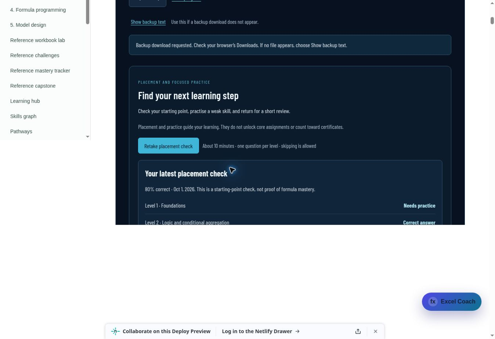
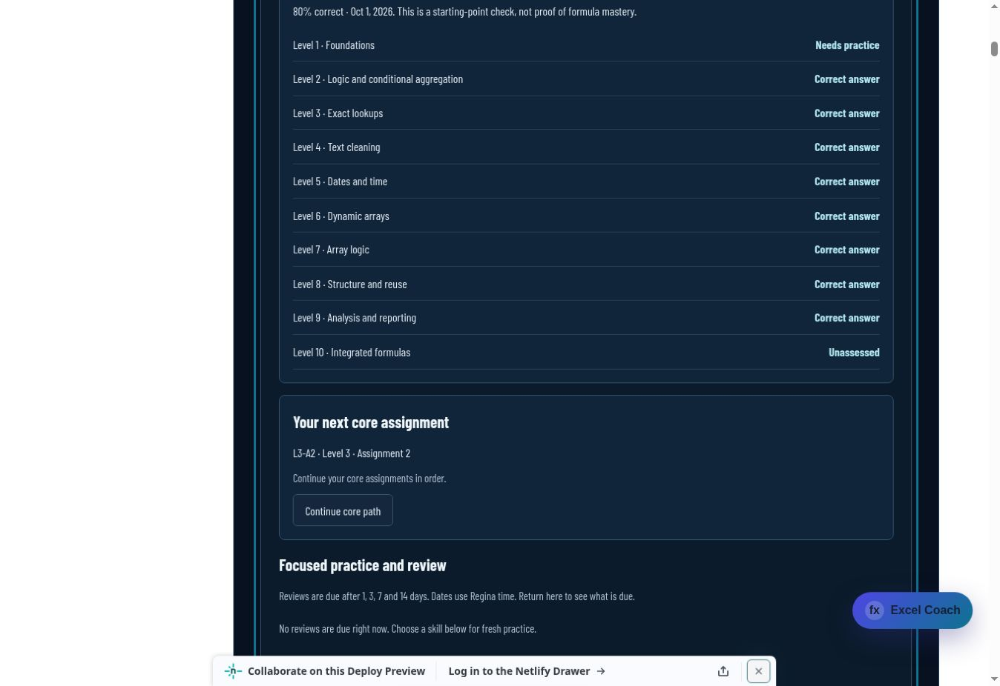

# Excel Formula Sprint student assessment and audit

Audit date: 2 October 2026. Scope: the learner journey on draft PR #234, including all 50 core assignments, three Expert capstones, the ten-question placement check, twenty practice drills, progress recovery, review scheduling, model comparisons and signed certificates. This is an engineering and teaching review with simulated learner workflows, not a study of real students.

## Assessment findings

Independent calculations from the public prompts and source rows match all **212 required outputs and 53 bonus outputs** across the 53 course packages. The twenty practice outputs are independently computed and checked in the content tests. Placement samples one concept per level, permits skipping, and labels unassessed skills. It recommends study; it does not replace the sequential core assessments.

The checker compares submitted result values and checks basic formula structure. It does not parse or execute a formula in Excel. Matching results alone cannot establish that the learner wrote a working formula independently. Certificates describe verified submitted results and signed progress; learner names are self-reported. Real Excel execution and human observation are needed to assess independent workbook proficiency.

## Gaps addressed

| Area | Confirmed gap | Correction |
| --- | --- | --- |
| Recovery | Equal-time IndexedDB and local snapshots could load the older draft | Prefer local recovery on timestamp ties and advance save timestamps monotonically |
| Recovery | A blocked IndexedDB request could prevent the course from opening | Bound storage waits and fall back to local or session storage |
| Older open tabs | Pre-learning and earlier learning-aware code could overwrite the unified record and erase newer core completions, drafts or practice | Keep a separately validated full progress recovery copy with writer/revision markers; preserve explicit reset/import semantics |
| Concurrent tabs | A stale modern tab could replace another tab's newer record, including when localStorage and IndexedDB availability differed | Check the protected copy atomically, refuse stale writes, retain the current draft for export and pause mutations until the latest progress is reloaded |
| Bonus assessment | Reapplying verified core completions discarded bonus attempts and results | Preserve bonus records without counting them toward completion or awards |
| Grading requests | Editing while a check ran could lose the newest draft or imply the edited formula was checked; a wrong revision could still show a green pass | Preserve newer edits and distinguish the current checked result from an earlier completed task |
| Reset/import | A late core verification response could alter replacement progress | Ignore responses from an earlier progress lifecycle |
| Startup | Optional AI availability could delay the assignment screen | Load assignments independently of coaching availability |
| Startup recovery | A closing page's final save could unnecessarily pause the replacement page; a later conflict during catalog loading could leave the loading screen without recovery controls | Retry protected-record loading within a bounded startup window and expose backup/reload controls for conflicts before the assignment shell exists |
| Study dates | The dashboard streak used the device timezone while reviews used Regina time | Use Regina calendar dates consistently |
| Review scheduling | A browser clock behind the server could reject the first review anchor | Schedule from the authenticated completion time |
| Practice recommendations | Starting fresh practice could reintroduce a previously addressed placement weakness | Retain verified review evidence when evaluating that weakness |
| Advanced models | Source review identified a risk of blank numeric cells becoming zero after binding in L8-A1/L10-A3; L8-A5 used range-only COUNTIFS on an array | Capture source numeric flags before binding and use array-safe Boolean aggregation; these are model hardening changes, not failures observed in native Excel |
| Beginner workbooks | The first ten workbook templates lacked readable task sheets and output layout | Supply styled starter workbooks with separate instructions and clear answer areas |
| Teaching sequence | CHOOSECOLS/HSTACK were required before their first function cards; L1-A4 gross-demand wording was ambiguous | Add first-use guidance and clarify that gross demand excludes stock deductions |
| Model guidance | Original array comparisons omitted their stored fill-down notes | Return the legacy modelNote field when note is absent |
| Coaching | Helper-cell instructions conflicted with the coach policy; formula snippets with alternate case could pass its answer filter | Permit explicitly instructed helpers/reference outputs and normalize formula-call filtering |
| Signed proofs | Alternate noncanonical signature encodings were accepted by core/certificate readers | Require canonical base64url signatures |
| Award validation | A one-item array could be accepted as an award identifier | Require a supported string award identifier |
| Downloads | The UI claimed completed downloads without browser acknowledgement | Describe download initiation and offer recoverable backup text |
| Course entry | Navigation mixed Sprint placement/certificates with the separate reference trackers | Give Sprint assignment, placement, progress and certificate sections explicit links; label reference practice |
| Reference certificates | A local record lookup and printable practice card claimed independently verified proficiency | Label the card, lookup and downloaded record as local practice while preserving existing record IDs |
| Assessment wording | Some text implied complete Excel syntax validation | State the actual output/basic-structure check and provide locale, precision and spill guidance |
| Deep links | Initial placement or progress links could scroll before the asynchronous Sprint sections existed | Focus the requested section after bootstrap, while respecting subsequent student navigation or edits |
| Search index | Revised lesson wording left the committed generated search index stale | Regenerate the canonical index and verify the exact Smart lesson search workflow |

The model review used Microsoft's primary documentation for [BYROW](https://support.microsoft.com/en-us/excel/functions/byrow-function), [COUNTIFS](https://support.microsoft.com/en-us/excel/functions/countifs-function), [MAP](https://support.microsoft.com/en-us/excel/functions/map-function) and [IS functions](https://support.microsoft.com/en-us/excel/functions/is-functions). Source-type preservation is a precaution inferred from those contracts; all expected result values remain unchanged.

## Verification

Local validation passes: **156 Sprint checks**, the exact Smart lesson search workflow's **122 checks plus 21 production-index checks**, and the complete site build. Search validation runs from a clean tracked checkout before generating production-only lessons. The generator remains portable and reproducible; build staging excludes server code and private grading keys. Arithmetic and OOXML checks are committed as reproducible audit scripts and run in the Sprint validation workflow.

All 73 workbooks were inspected across 293 sheets: 11,720 source cells match the public datasets and all 3,258 learner answer cells remain empty. The 46 changed workbook sheets were rendered and independently reviewed; no clipping or unreadable instructions were found. These checks include the ten newly styled foundations workbooks and the re-authored L8-A5 template.

Focused regressions exercise first visits, skipped placement questions, exact array/text results, wrong-to-correct retries, model gates, bonus retention, edited and incorrect revisions, offline/service errors, corrupt and blocked storage, older writers, mixed storage availability, concurrent tabs, late responses, backup access and explicit reset/import. Signed core/Expert/certificate scope and old proof compatibility remain covered. Independent final engineering review and live preview verification are the release checks.

The first audited build was verified on [draft preview #234](https://deploy-preview-234--upskillsprint.netlify.app/lessons/power-bi-excel-sql/excel-formula-fluency#sprint-learning), Netlify deploy `6abf1770dbf9000008ef29b4`, source commit `08f8cf63170784b5a55f251c7cc46a60c49da357`.

| Live student workflow | Observed result |
| --- | --- |
| Restore an actual earlier exported QA backup | Ten signed core completions, an 80% placement result, twenty practice results and ten review records restored |
| Complete L3-A1 from public source rows | Four required results passed and produced the eleventh signed completion; next core assignment became L3-A2 |
| Submit a wrong revision after completion | Current task showed revised-answer feedback without a green badge; earlier completion and attempt history remained |
| Complete the optional bonus | Correct bonus remained separate from the core award and survived recovery |
| Let an older pre-learning lesson tab save | All eleven signed completions, twenty practice results and the bonus remained in the protected recovery record |
| Export a fresh backup | Actual 59,629-byte downloaded JSON contained eleven completions, the 80% placement result, twenty practice results, ten reviews and the correct bonus |
| Inspect placement and next-step guidance | Placement result remained visible and recommendations used the restored history |

The older-tab check exposed an unnecessary pause on normal reload. That startup timing gap and the later pre-shell conflict are covered by additional deterministic regressions. The follow-up build was verified on the same preview, Netlify deploy `6abf1ec7d0cf30000868c124`, source commit `eb2ef6bd6f6c39289ccd38214c2e7cb0bae2e1c7`:

- A normal reload after another old-tab save opened L3-A1 as solved and verified without a paused or empty assignment. Backup text retained eleven signed core completions, twenty drill records, ten reviews, the 80% diagnostic and the correct bonus.
- The initial `#sprint-learning` link focused placement after asynchronous loading and put its section at the top of the viewport. Next core assignment remained L3-A2.
- A wrong checked revision showed “The revised answer needs more work” globally and beside the task, with no green pass on the revised field. Restoring and checking the public-derived value produced the correct-revision message and preserved the original completion.
- Independent startup-boundary checks kept the exact `001` draft and saved time exportable during catalog/verification conflicts; a pending storage read disabled export until the snapshot resolved. The newer foreign record remained untouched.

Smart lesson search and Sprint validation both passed on this source commit. The remaining site workflows are checked on the final PR head before handoff.

## Practical limits

No native Microsoft Excel session was available for executing every model formula. Workbook source/readback checks and rendered-sheet reviews verify the supplied files and layout, not Excel calculation behavior. Optional AI coaching is tested with a mocked provider; this audit does not establish live provider reliability. Review reminders appear on return visits and do not send background notifications.

Progress belongs to this browser unless the learner exports a backup. The new recovery copy protects against older open tabs but is not cloud account synchronization. It cannot reconstruct work erased before this protection existed; the actual older exported QA backup is used to restore that work in the live check. Keep exported backups to recover from browser storage deletion or another device.
