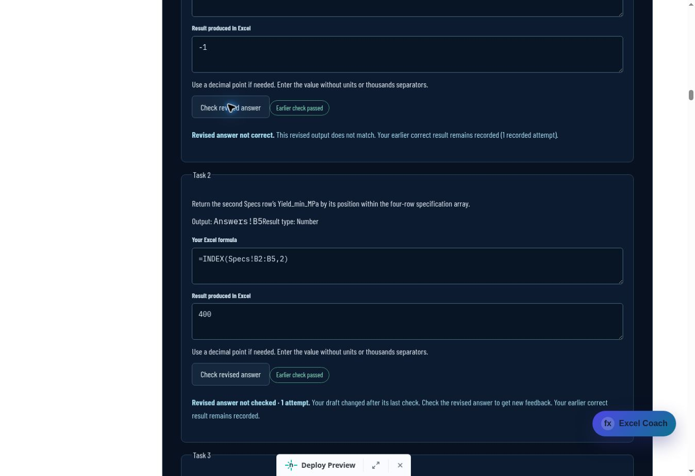
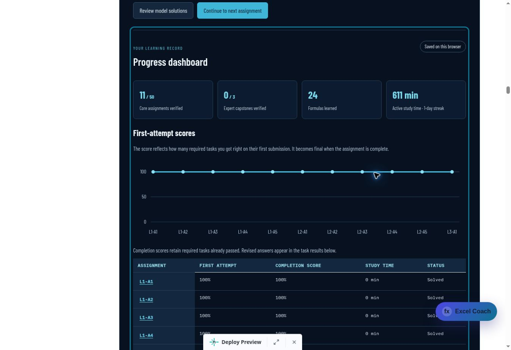

# Excel Formula Sprint: second student assessment and audit

Audit date: 2 October 2026 (UTC). This is a second engineering and teaching audit with simulated student workflows. It is not a study of real students or a native Excel proficiency assessment. Scope includes all 50 core assignments, three Expert capstones, ten placement questions, twenty practice drills, reference practice, progress recovery, solution reviews and signed certificates on draft PR #234.

## Confirmed gaps fixed

| Area | Student-visible failure or validation gap | Fix |
| --- | --- | --- |
| Completion retry | A failed follow-up verification could cause the next check to append the same completion proof twice | Keep the saved check, deduplicate the proof and require saved-progress verification before further grading |
| Practice feedback | An incorrect revision of a completed drill could receive a “Correct” hint | Describe the current incorrect result while retaining the earlier earned completion |
| Dashboard | A failed revision was listed as correct and historical completion score was called the latest score | Separate completion score from latest checked or unchecked revision feedback |
| Save status | Memory-only progress was labelled saved on the browser; a durable full recovery copy was not counted as saved when the primary key failed | Show temporary/paused status accurately and recognize successful full recovery storage |
| Partial storage writes | A newer successful primary save with an older failed recovery copy could pause a usable reload | Recognize a newer marked primary while retaining same-revision writer conflicts and stale-write protection |
| Backup size | A valid full-course export could exceed the 2 MB import limit | Use one finite 128 MiB UTF-8 limit across import and recovery; retain package, field and proof validation bounds |
| Malformed import | Local correct flags without a receipt or verified completion could block bulk checking | Clear unproven required scores and counters while retaining exact drafts, checked text and study time |
| Import value types | Array-shaped selections or placement choices could pass string coercion and strand imported records | Require actual supported strings before accepting those fields |
| Partial proof recovery | A corrupt nonempty receipt could preserve false local pass flags and block retry | Verify partial receipts against the assignment's signed predecessor, restore authoritative counters, retain unavailable proofs for retry and recover corrupt proof records without discarding drafts |
| Optional history | A completed package without its grading receipt could present local bonus claims as verified | Keep the optional history, label it unverified and require a real bonus check for current feedback |
| Grading receipt | False, zero and empty-string receipts were treated as a fresh attempt, losing prior-attempt semantics | Reject those malformed receipts; omitted/null fresh-attempt compatibility remains |
| Practice proof restoration | A mixture of valid and long corrupt proofs could exceed the server request limit and hide a valid report | Split verification into batches using serialized UTF-8 size, preserving the server's 64 KB body limit |
| Solution review | A late response could write into a detached panel after reopening the assignment | Check the current progress lifecycle and completion proof, then render into the current panel |
| Dataset copy | Clipboard denial could place core data inside an open practice dataset | Scope the fallback to the requested core dataset and ignore stale responses |
| Certificate creation | A failed reissue discarded the previously issued certificate in the tab | Retain the existing signed artifact; show and focus actionable name/service errors |
| Certificate copy | An older clipboard promise could overwrite feedback or select a different proof after editing | Ignore copy success/denial from an obsolete verification lifecycle |
| Certificate files | JSON null/arrays could expose a raw property-access error | Validate the proof object and show the signed-proof file error |
| First-use teaching | L7-A4 called IFNA a review before its first function card | Teach IFNA at first use, with its specific #N/A scope |
| Date example | A bare DATE formula was presented with an ISO text result | Wrap the displayed date example in TEXT and explain that DATE returns a numeric serial |
| Dashboard bonus | L10-A4 labelled a row-wise comparison as COUNTIFS while its model used SUMPRODUCT | Name SUMPRODUCT in the prompt and regenerated workbook instructions |
| Capstone wording | Suggested four-function combinations could be read as a grading requirement | Label them practice aims; equivalent formulas remain accepted |
| Reference storage | Corrupt JSON or unavailable browser storage could stop the reference lesson | Preserve unreadable raw values, show recovery/save status and continue with an exportable temporary record |
| Reference profile recovery | The profile/backup launcher depended on a removed header; malformed imported or nested records could crash rendering | Expose the profile/backup entry beside save status, normalize legacy profile metadata and reject invalid record shapes |
| Reference lookup | A malformed local credential ID could throw during lookup | Preserve invalid stored records and guard the local ID lookup |
| Reference assessment | Post-submit navigation dereferenced a cleared session; background time was not fully deducted | Disable completed-session navigation and calculate remaining time from an absolute deadline |
| Reference model | Challenge 49 used COUNTA on FILTER's empty-text fallback, so no-match guidance was wrong | Count nonempty matches explicitly and return “No records” for an empty selection |

The COUNT fallback follows Microsoft's [COUNTA contract](https://support.microsoft.com/en-us/excel/functions/counta-function): empty text is counted as a value. The teaching review also used the primary [IFNA](https://support.microsoft.com/en-us/excel/functions/ifna-function) and [DATE](https://support.microsoft.com/en-us/excel/functions/date-function) documentation. These are source-contract checks, not claims of native Excel execution.

## Assessment and workbook coverage

Independent calculations from public rows and task contracts still match all **212 required outputs and 53 bonus outputs** across the 53 course packages, plus all **20 practice outputs**. Review covers 285 task/bonus contracts, 293 model/alternative formulas and 880 static worksheet-name references. All 830 protected expected-output, tolerance, ordering and diagnostic-choice fields remain unchanged from the first audited head.

The expanded OOXML audit checks all **73 workbooks / 293 worksheets**, **11,720 public source cells**, **3,258 blank learner answer cells**, and **358 matching scenario/task contracts**. It also checks column meanings, nonoverlapping output ranges and absence of hidden-sheet/model-formula leaks. The changed L10-A4 workbook's six sheets were rendered and reviewed; its corrected instructions and blank answer layout are readable.

The backup regression round-trips a full-course and Expert record containing every task, Unicode drafts/results, checked snapshots, practice and bounded placeholder proof fields. Signature verification is tested separately with genuine server-signed chains and receipts. The limit calculation also accounts for six-byte JSON escaping; it does not allocate a 128 MiB filler file. Malformed fields and excessive proof/package counts remain rejected.

## Validation and live evidence

All **208 Sprint tests pass**. The exact Smart lesson search workflow passes **122 source checks and 21 production-index checks**, with a deterministic canonical index and the complete production build. All 245 generated curriculum/download/key files reproduce byte-for-byte. Production staging excludes server code and grading keys; generated SQL content is searchable. Modified JavaScript syntax and whitespace checks pass.

Focused coverage includes partial receipt authentication, malformed import types, current versus historical feedback, long Unicode backups, selective storage write failures, reset-generation barriers, concurrent and older writers, stale responses, keyboard focus, certificate copying/reissue, reference profiles and absolute-deadline assessment expiry. All 53 original package partial/completed proof fixtures remain compatible. A real-handler mixed restoration probe retained a genuine placement report among 30 invalid learning receipts using six requests, each below 64 KB.

All seven GitHub workflows passed on source commit `fc7a944177f8993caf7b83e5a58dfa19e88e5083`. Netlify deploy `6abf2c8a89e7dd000891ccd9` is ready for that exact source. Live checks used the [draft student preview](https://deploy-preview-234--upskillsprint.netlify.app/lessons/power-bi-excel-sql/excel-formula-fluency#sprint-dashboard).

| Live student workflow | Observed result |
| --- | --- |
| Reload the actual earlier QA session | Eleven signed core completions verified; L3-A1 stayed solved and no storage-conflict pause appeared |
| Check an incorrect L3-A1 revision | Current result showed “Revised answer not correct,” no green field, and dashboard “Latest check incorrect; earlier pass retained”; all eleven completions remained |
| Restore the public-derived value 420 | Correct revision feedback returned and the original completion remained |
| Start fresh R1-A1 practice and submit -1 | One incorrect attempt received the measured-zero/blank hint and models stayed locked |
| Retry with the public mean 536 / 19, rounded to 28.21 | Practice completed after two attempts; model/alternative review unlocked |
| Inspect backup text | Eleven core proofs, twenty drill records, ten reviews, 80% placement and the correct L3-A1 bonus remained |
| Open the repaired reference profile entry | The profile dialog opened with Export profile and Import profile controls |
| Inspect the dashboard | Save status, retained completion scores and signed completion count displayed correctly |

Completed drills intentionally use a fresh-practice action; the backend's incorrect-revision receipt case is covered by deterministic tests. Native Excel execution is not inferred from these copied result checks.

The final evidence update is checked on the final PR head before handoff. PR #234 remains a draft and main is unchanged.

## Assessment boundaries

The checker compares submitted outputs and basic formula structure. It does not parse or execute Excel formulas, verify formula-family use, identify the learner or establish independent formula-writing proficiency. Signed certificates cover submitted results and signed progress; names are self-reported. Placement and practice guide study without unlocking the sequential core path or counting toward awards.

Native Microsoft Excel execution and live AI-provider reliability are not claimed. AI coaching has provider-mocked coverage. Progress recovery is local browser protection, not cloud synchronization; exported backups are still needed for storage deletion or another device. Reference assessment cards remain local practice records.
