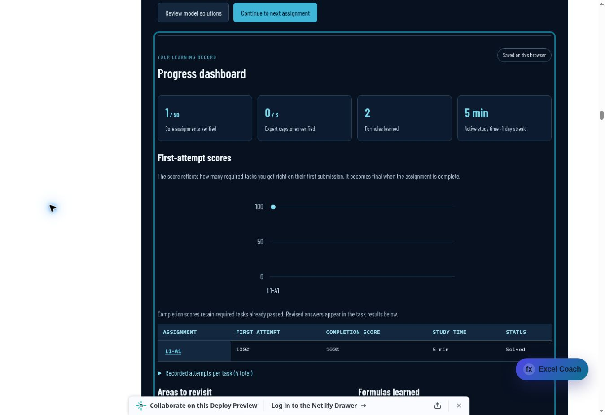

# Excel Formula Sprint: third student-use assessment and audit

Audit date: 2 October 2026, Regina time. This is a fresh engineering audit using simulated student workflows, independent public-data calculations, workbook inspection, automated browser tests and a live preview session. It is not a real-student research study or native Microsoft Excel proficiency assessment.

## Confirmed gaps fixed

| Student interaction | Reproduced gap | Correction |
| --- | --- | --- |
| Copy practice data, leave, reopen the same drill | A delayed clipboard success displayed obsolete feedback; denial could select a fallback in the newly opened view and steal focus | Accept replies only for the original connected view and latest copy request |
| Copy progress backup, then close it or receive newer feedback | A delayed success replaced current validation feedback; denial could focus hidden or obsolete text | Bind the reply to the original panel, backup snapshot, feedback sequence and latest copy request |
| Resume editing while backup copy is pending | Denial could take focus away from current work | Require focus to remain within the backup panel before applying the reply |
| Close and reopen the same backup panel | A still-pending response could belong to the previous opening | Invalidate pending copies whenever the panel opens or closes |

The first two regression cases failed before the fix. Coverage exercises successful and denied clipboard replies, same-drill reopening, closed panels, newer validation feedback, resumed editing and reopened backup text. Normal immediate clipboard-denial fallback still works. These changes protect feedback and focus; they cannot cancel text already handed to the browser clipboard.

## Full-course reassessment

The Sprint suite covers all 50 core assignments, three Expert capstones, ten placement questions, twenty practice drills, sequential unlocks, model gating, first-attempt history, signed certificates, partial receipts, blocked storage, corrupt imports, multiple writers, resets, stale responses and reference assessment/profile recovery.

Independent computations from public data match all 212 required outputs and 53 bonuses across the 53 core/Expert packages, with no shape or value mismatches. Practice output contracts remain covered by the learning-content and grading tests. No assessment answers, tolerances, teaching datasets or award requirements were changed this round.

All 73 public workbooks / 293 worksheets pass the OOXML audit: 11,720 public source cells, 3,258 blank learner answer cells and 358 scenario/task contracts. No hidden sheets, leaked formula answers, overlapping answer ranges or source mismatches were found. Workbook checks are structural and contract checks, not formula recalculation in Excel.

## Verification

- 212 Sprint tests pass, with zero failures or skipped tests.
- 122 canonical search/catalog checks and 21 production-index checks pass in a clean tracked-source snapshot.
- The complete production build passes and stages public content without server code or private grading keys.
- Generated Sprint curriculum, workbooks and server grading/coaching assets reproduce byte-for-byte.
- Modified JavaScript syntax and `git diff --check` pass.

The initial combined search run in the working directory encountered unrelated untracked generated lesson files. Those files were preserved. The clean tracked-source run passed; no unrelated lesson changes were made to conceal the initial result.

## Live student-use evidence

A fresh browser session used draft PR #234's Netlify preview. Source commit `aa7cb49ec44105313dbb66fe58c705ca89c443fb` had all seven GitHub workflows pass and ready deploy `6abfa660973e6b0007d24722`. The final follow-up also includes the stronger backup focus/reopening guards and this report; its CI/deploy are verified separately before handoff.

| Journey | Observed result |
| --- | --- |
| Fresh entry | L1-A1 ready; later core assignments, Expert capstones and awards locked |
| Partial placement | One correct answer produced 10%; one explicit skip and eight unanswered questions were unassessed; core sequence unchanged |
| Independent practice selection | All twenty variants available regardless of placement |
| Wrong R1-A1 result (-1) | One incorrect attempt, zero/blank hint, no model button |
| Correct R1-A1 result (28.21) | Completed after two attempts; model and equivalent formula unlocked; review due Oct 3 in Regina time |
| Core L1-A1 from displayed public rows | Results 2446.73, 61.791666666666664, 92.7494313874147 and 7.969583333333333 accepted; only L1-A2 unlocked |
| Reload | Signed core completion and two-attempt practice retained; dashboard 1/50, original 100% first attempt and completion scores |

Two initial automated submit clicks produced no visible response and were retried once after inspecting unchanged inputs. The accepted server responses recorded one incorrect and one correct practice attempt, and one attempt per core task. The cause of those first-click observations was not isolated; they are not evidence of duplicate grading or lost drafts. Deliberate delayed-clipboard cases are tested deterministically, not by changing browser permissions on the live preview.

## Boundaries and release state

The Excel coaching skill guided the teaching/data-contract review and the distinction between result checking and proficiency. The Netlify deployment guidance kept the release on the existing draft preview. PR #234 stays a draft; main is unchanged.

Native Microsoft Excel execution, full screen-reader testing, a real student pilot and live AI-provider reliability are not established by this audit. The checker compares outputs and basic formula structure, not actual workbook execution or identity. Local progress protection is not cross-device cloud synchronization; students still need exported backups.
